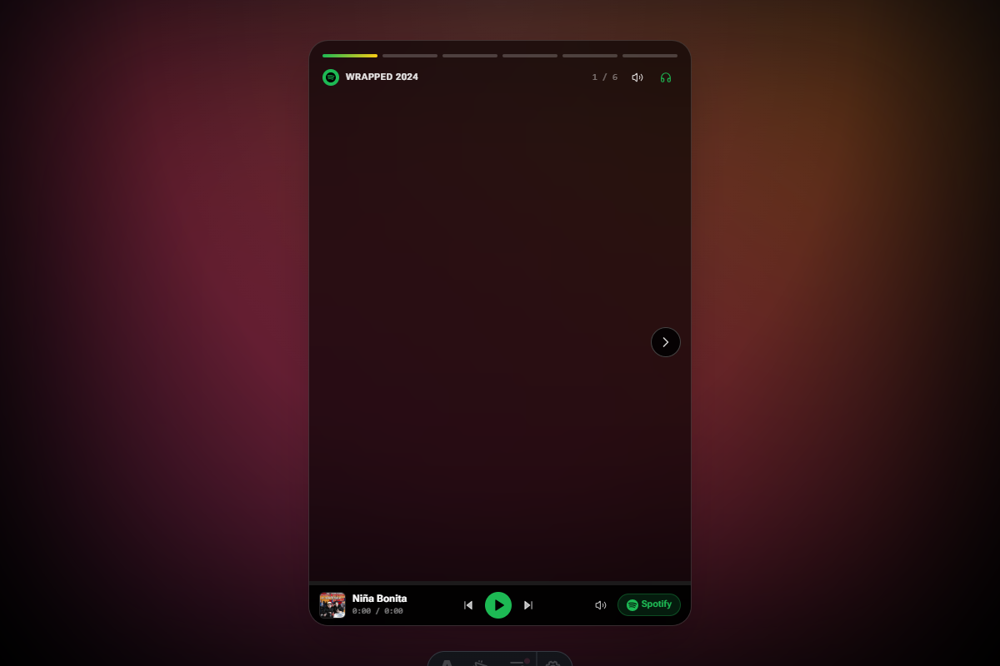
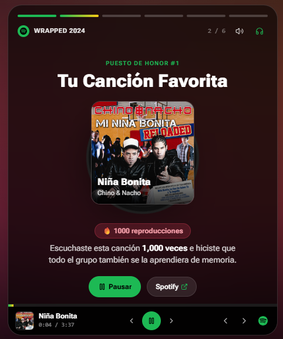
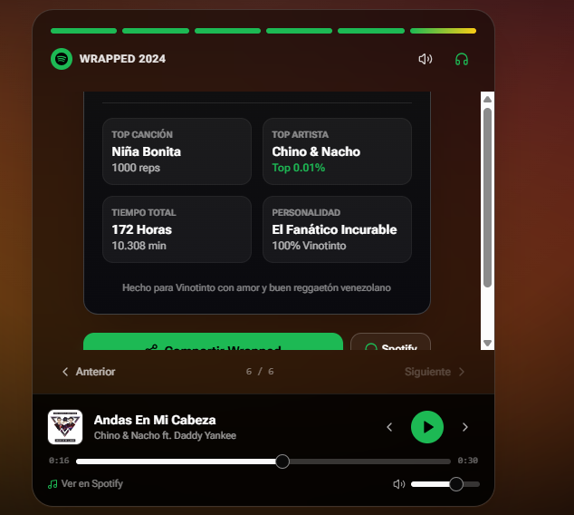

# 🎵 Spotify Wrapped 2024 - Mr. Vinotinto

Una experiencia interactiva web inspirada en **Spotify Wrapped**, diseñada para revivir el año musical con animaciones dinámicas, historias interactivas y reproducción de audio en tiempo real conectada a Spotify.

---

## 📌 Contexto del Proyecto

> Este proyecto fue desarrollado como un pedido personalizado para el cumpleaños de un cliente, con el objetivo de crear una página interactiva estilo *Spotify Wrapped* que conmemora de manera divertida sus canciones, artistas y estadísticas musicales más escuchadas del año.

---

## 🛠️ Tecnologías Utilizadas

El proyecto fue construido combinando tecnologías web modernas para lograr máximo rendimiento, diseño premium y fluidez visual:

- **[Astro 5](https://astro.build/)**: Framework web enfocado en velocidad y arquitectura de islas (Static Site Generation - SSG).
- **[React 18](https://react.dev/) & [TypeScript](https://www.typescriptlang.org/)**: Para la gestión de estado de la experiencia, interactividad de las diapositivas y tipado estricto.
- **[Tailwind CSS](https://tailwindcss.com/) & Vanilla CSS**: Sistema de estilos utilitarios, variables CSS para modo oscuro, estética de *glassmorphism* y adaptación 100% responsive.
- **[Framer Motion](https://www.framer.com/motion/)**: Animaciones de transición entre historias, efectos de entrada/salida y micro-interacciones dinámicas.
- **[Lucide React](https://lucide.dev/)**: Iconografía moderna y minimalista para controles de reproducción y navegación.
- **HTML5 Audio API**: Motor de audio nativo para reproducción directa en el navegador, sincronización de progreso, control de volumen y visualizador de ecualizador animado.
- **Integración con Spotify**: Conexión oficial mediante Spotify oEmbed, pistas verificadas de canciones, enlaces directos y widget embebido (*Spotify Embed Player*).

---

## ✨ Características Principales

- 📱 **Diseño 100% Responsive & Estilo Stories**: Optimizado para pantallas móviles (`100dvh`), tablets y ordenadores con barras de progreso segmentadas y auto-avance.
- 🎛️ **Navegación Intuitiva**: Flechas flotantes laterales de cambio de diapositiva, soporte para gestos táctiles (toque a los lados o mantener presionado para pausar) y atajos de teclado (`Flechas`, `Espacio`, `M`).
- 🎧 **Sistema Dual de Música**:
  - **Reproductor Web Integrado**: Barra inferior compacta con carátula oficial, disco de vinilo giratorio en 3D, ecualizador animado y barra interactiva de progreso.
  - **Reproductor Oficial de Spotify**: Modal con el widget oficial embebido para reproducir temas y abrir directamente en la app de Spotify.
- 📊 **Diapositivas Personalizadas**:
  1. **Intro**: Bienvenida a Mr. Vinotinto con partículas y resumen general.
  2. **Canción #1**: "Niña Bonita" de Chino & Nacho con disco de vinilo giratorio y conteo de reproducciones.
  3. **Horas Acumuladas**: Contador de 172 horas de música con diagnóstico humorístico.
  4. **Top 5 Canciones**: Lista interactiva para reproducir cualquiera de los éxitos favoritos.
  5. **Artista del Año**: Reconocimiento en el Top 0.01% de oyentes mundiales de Chino & Nacho.
  6. **Tarjeta de Resumen**: Póster digital compartible con lluvia de confeti y botón para copiar enlace.

---

## 📸 Capturas de Pantalla

### 1. Pantalla de Bienvenida
Iluminación ambiental dinámica y presentación del Wrapped 2024.



---

### 2. Canción Favorita #1 ("Niña Bonita")
Disco de vinilo giratorio 3D, carátula en alta resolución y reproductor integrado.



---

### 3. Resumen Final & Compartir
Tarjeta con las métricas anuales, personalidad musical y opciones para compartir.



---

## 🚀 Instalación y Uso Local

1. **Clonar o descargar el repositorio:**
   ```bash
   git clone https://github.com/Miguel19x/wrapped.git
   cd wrapped
   ```

2. **Instalar dependencias:**
   ```bash
   pnpm install
   # O con npm:
   npm install
   ```

3. **Iniciar el servidor de desarrollo:**
   ```bash
   pnpm dev
   # O con npm:
   npm run dev
   ```
   Abre [http://localhost:4321](http://localhost:4321) en tu navegador para ver la aplicación.

4. **Compilar para producción:**
   ```bash
   pnpm build
   ```

---

*Desarrollado con dedicación para celebrar el cumpleaños de Mr. Vinotinto.* 🇻🇪🎶
